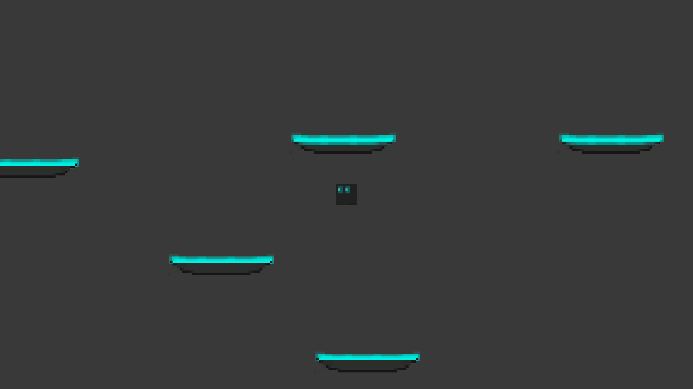
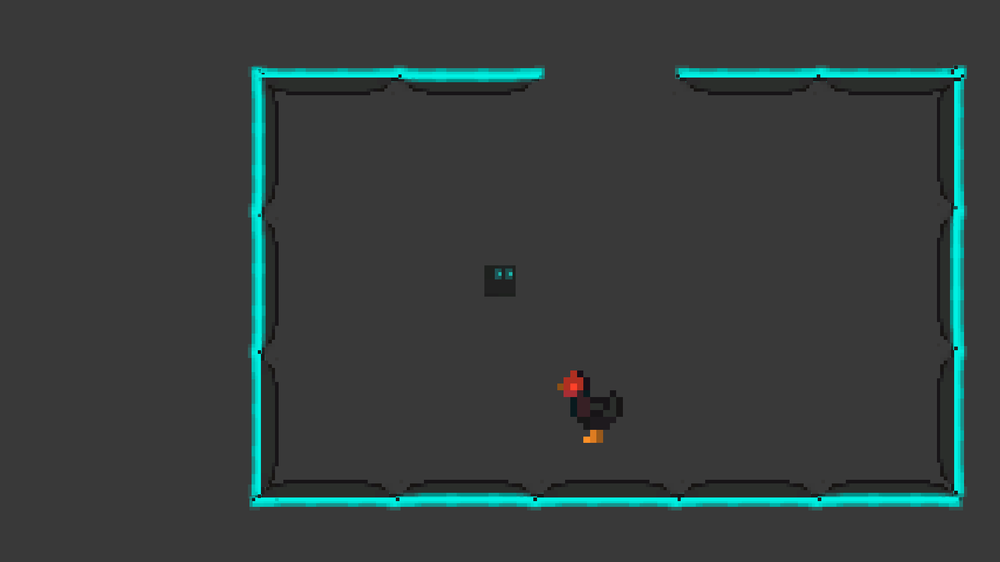
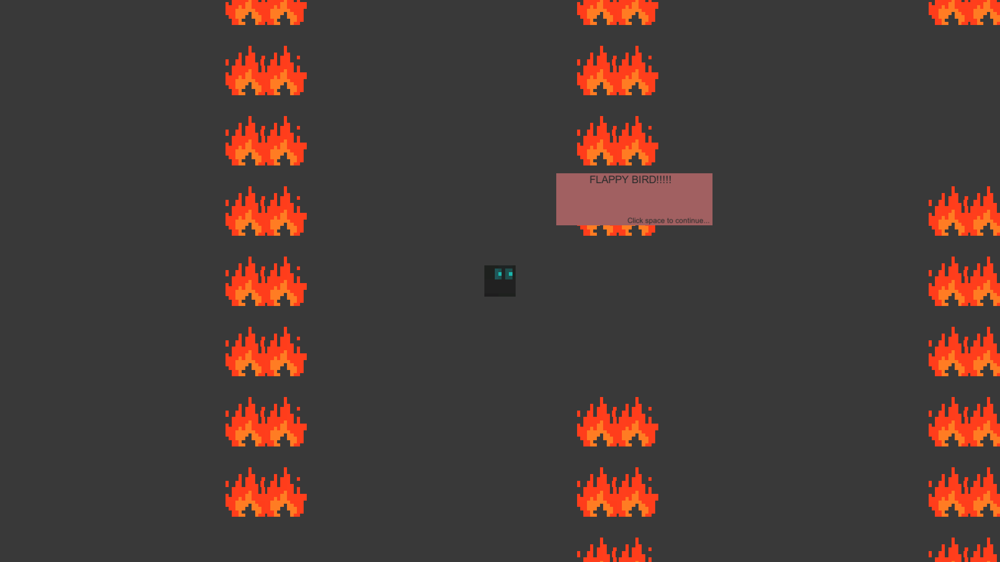
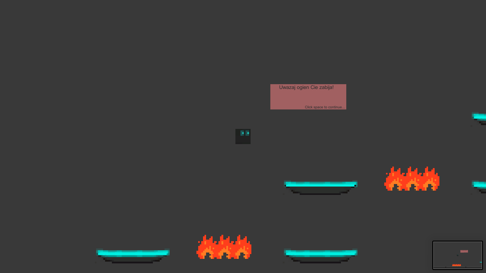
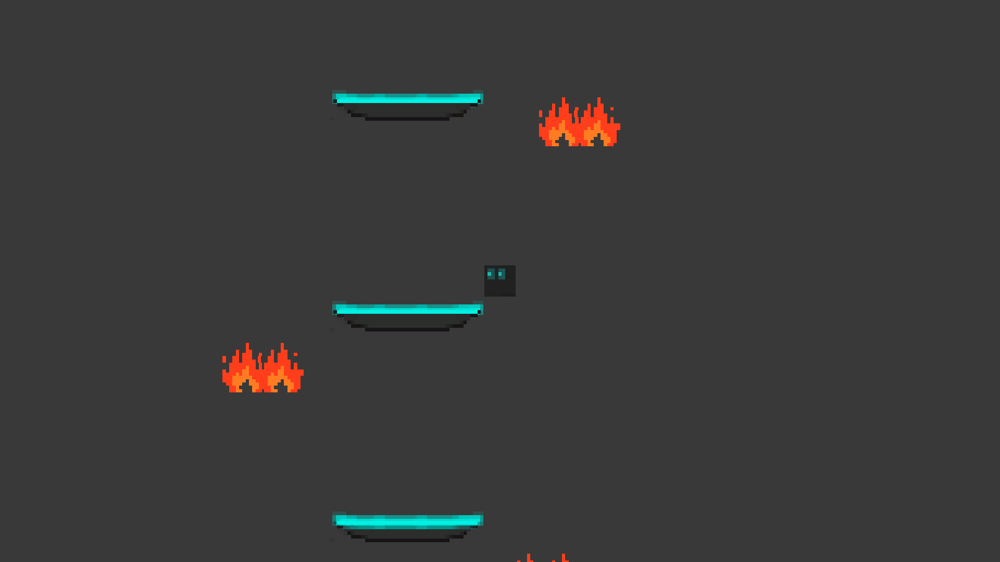
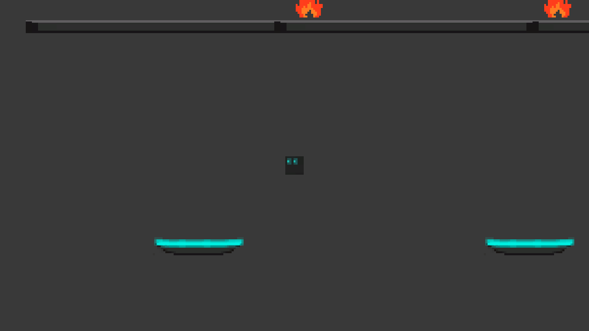
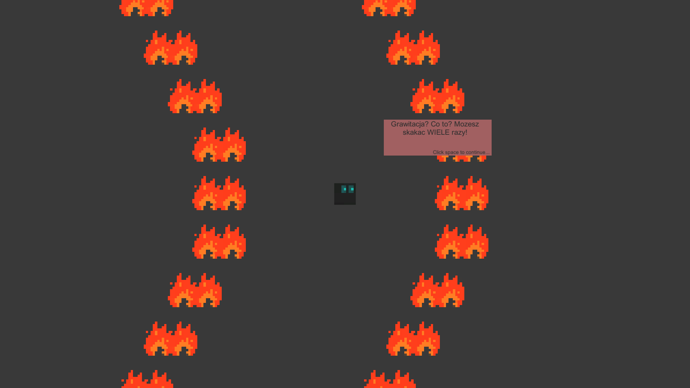
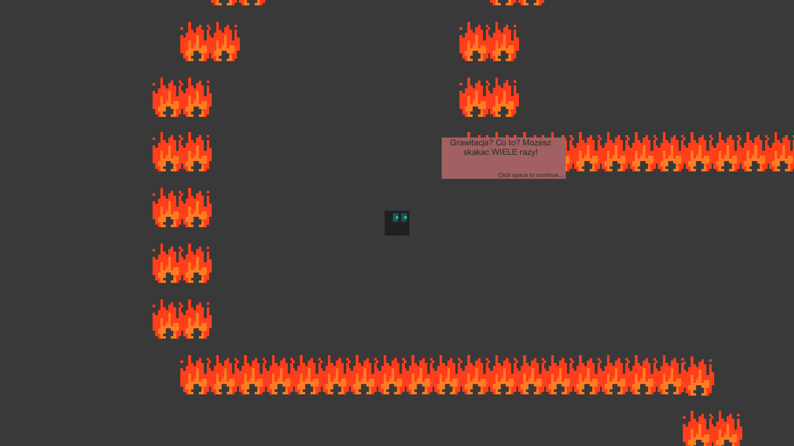
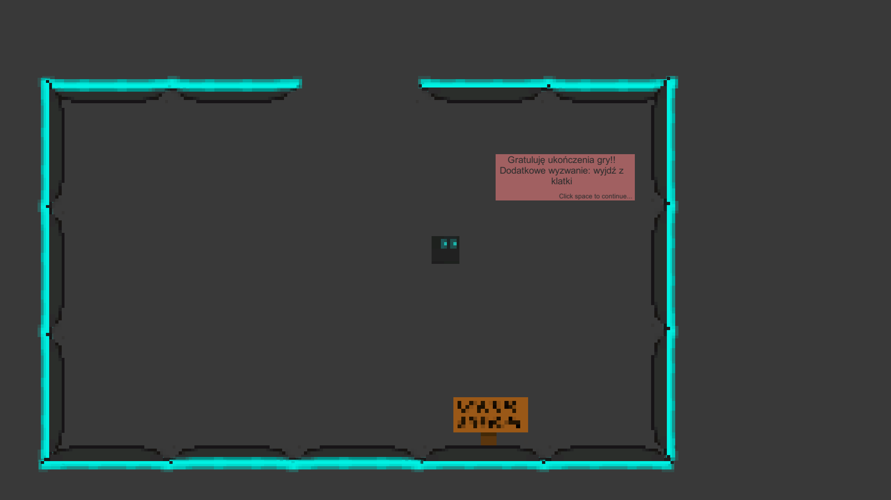

# PlatformGame

This project was made around 2019 when I was 16 yo.
Everything (except menu img) was made by me.
Platform game with few levels. The goal is to get to the chicken.

<table>
  <tr>
    <td>
      
    </td>
    <td>
      
    </td>
    <td>
      
    </td>
  </tr>
  <tr>
    <td>
      
    </td>
    <td>
      
    </td>
    <td>
      
    </td>
  </tr>
  <tr>
    <td>
      
    </td>
    <td>
      
    </td>
    <td>
      
    </td>
  </tr>
</table>
